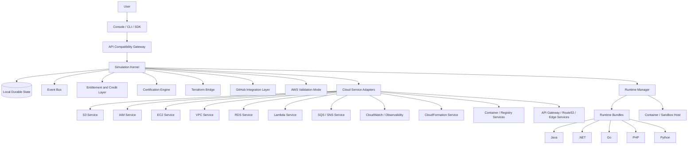

# CloudLearn - Full Simulator Architecture

## 1. Product Definition

CloudLearn is a local-first cloud learning platform that gives users an AWS-like operating experience on their own machine. It is designed to:

- simulate cloud workflows with near-real user experience,
- run lightweight applications locally,
- persist all simulator state on the user's device,
- support official AWS API surfaces for common workflows,
- export and import infrastructure through Terraform,
- add certification exercises and scoring,
- and later extend to Azure and GCP using the same simulator core.

The simulator is not a copy of AWS internals. It is a compatible experience layer backed by a custom lightweight runtime.

## 2. Architectural Principles

- Local-first: the simulator must work without cloud hosting.
- Persistent: state survives stop and start.
- Compatible: common AWS APIs and workflows should behave as expected.
- Lightweight: use the simplest backend that provides the user-facing result.
- Modular: services and runtime bundles must be pluggable.
- Provider-neutral core: AWS is first, but Azure and GCP should reuse the same engine.
- Secure by design: signing, entitlement, tamper detection, and local lockout are part of the platform.

## 3. Top-Level System View

## 4. Control Plane

The control plane is the local application that the user installs and launches. It owns:

- UI rendering
- request routing
- simulator orchestration
- local persistence
- lifecycle management
- entitlement enforcement
- workflow state
- certification tracking
- source-control deployment flow

The control plane should stay thin in business logic. It should delegate most domain behavior to the simulation kernel and service adapters.

## 5. Simulation Kernel

The kernel is the source of truth for simulator state. It manages:

- accounts and regions
- resource graph
- workflow execution
- latency and failure simulation
- region outages and recovery
- object and instance lifecycles
- event emission
- snapshot creation and restore
- transition validation

The kernel should expose a small internal API:

- `create_resource`
- `update_resource`
- `delete_resource`
- `query_resource`
- `record_event`
- `save_snapshot`
- `restore_snapshot`
- `evaluate_policy`
- `check_entitlement`

## 6. Local Persistence

All user-visible state must persist locally.

Recommended storage layout:

- SQLite for structured records
- local files for artifacts and uploads
- event log for workflow history
- snapshot table for restart
- encrypted store for license and identity tokens

State persisted locally:

- simulator configuration
- account and region inventories
- cloud resources
- runtime instances
- uploaded artifacts
- workflow runs
- certification attempts
- credit usage
- entitlement decisions
- lockout events
- GitHub integration tokens

## 7. API Compatibility Layer

The API layer exposes AWS-style endpoints and request shapes. Its job is to:

- accept AWS CLI and SDK traffic,
- normalize request parameters,
- validate documented inputs,
- produce AWS-like responses,
- convert internal errors into AWS-like errors,
- preserve common headers and metadata,
- route to the correct service adapter and region.

The compatibility layer should not own business state.

## 8. Entitlements, Credits, and Lockout

CloudLearn uses a capability system to gate premium features.

Plan tiers:

- Free
- Pro
- Max
- Enterprise

The entitlement layer decides:

- what a user can access,
- how many credits are available,
- which services are enabled,
- which labs are unlocked,
- whether validation mode is allowed,
- whether multi-region is allowed,
- whether certification mode is allowed.

Security model:

- licenses are signed,
- bundles are signed,
- tamper detection can quarantine the client,
- only a cloud-issued unlock can release a locked installation,
- the local client caches valid entitlements for offline use when allowed.

## 9. Runtime Layer

The runtime layer exists to run lightweight applications locally. It should support:

- source-based deployment,
- artifact-based deployment,
- container-based execution,
- local ports and network exposure,
- environment variable injection,
- simulated cloud metadata,
- logs and health checks,
- lifecycle operations.

## 10. Runtime Bundles

Each language runtime is a bundle that plugs into the runtime manager.

Supported bundle types:

- Java
- .NET
- Go
- PHP
- Python

Each runtime bundle should provide:

- build template,
- startup command,
- health checks,
- default ports,
- packaging rules,
- dependency handling,
- log conventions,
- restart behavior.

The runtime manager should call a common interface:

- `supports(language, framework)`
- `prepare(workload_spec)`
- `start(instance_spec)`
- `stop(instance_id)`
- `restart(instance_id)`
- `logs(instance_id)`
- `health(instance_id)`

## 11. GitHub Deployment Layer

Users can connect GitHub to deploy code into simulated environments.

The integration layer should:

- authorize repository access,
- browse repos and branches,
- resolve commits and tags,
- fetch source,
- build or package locally,
- deploy into the selected runtime bundle,
- track deployment history,
- support rollback.

Use GitHub App or scoped OAuth tokens, stored securely on the local machine.

## 12. Certification Engine

Certification exercises are first-class product content.

The certification engine should:

- define labs and exam scenarios,
- track steps and expected outcomes,
- score user actions,
- enforce timing rules,
- store progress locally,
- support hint modes and exam modes,
- verify completion against hidden rules.

Exercise packs should be versioned and pluggable.

## 13. AWS Validation Mode

Validation mode allows the same workflow to be compared against real AWS.

This mode should:

- remain optional,
- compare request and response shapes,
- compare state transitions,
- surface differences,
- support lightweight application verification.

It is a compatibility aid, not the default runtime.

## 14. Terraform Bridge

Terraform is the portability bridge between the simulator and real cloud.

The bridge should:

- export simulator state to Terraform,
- import Terraform into simulator state,
- map simulator resources to IaC resources,
- preserve desired state across local and cloud workflows.

## 15. Service Architecture

The simulator should implement AWS-like service families through lightweight adapters and runtime backends.

### 15.1 S3

Purpose:
- object storage simulator.

Back end:
- local filesystem or embedded object store.

State model:
- buckets, objects, versions, metadata, tags, multipart uploads.

Core behaviors:
- create and delete bucket,
- upload and download object,
- list objects with prefix and delimiter,
- versioning,
- tagging,
- multipart upload,
- copy object,
- range requests,
- batch delete.

### 15.2 IAM

Purpose:
- identity and access simulator.

Back end:
- simplified policy and principal evaluator.

State model:
- users, groups, roles, policies, sessions, attachments.

Core behaviors:
- create identities,
- attach policies,
- simulate role assumption,
- evaluate allow/deny,
- support read-only and restricted personas.

### 15.3 EC2

Purpose:
- compute instance simulator.

Back end:
- container or sandbox runtime.

State model:
- instances, AMI template, key pair, security groups, volumes, metadata, state transitions.

Core behaviors:
- launch instance,
- pending to running transition,
- stop, start, reboot, terminate,
- assign IP,
- expose metadata service,
- surface console output,
- attach volumes,
- restart workloads.

### 15.4 VPC

Purpose:
- networking and boundary simulator.

Back end:
- network policy and endpoint mapping.

State model:
- VPC, subnet, route table, security group, endpoint, peering, gateway.

Core behaviors:
- create network boundaries,
- attach instances and services,
- apply ingress and egress rules,
- simulate public/private routing,
- support multi-region connectivity concepts.

### 15.5 RDS

Purpose:
- relational database simulator.

Back end:
- local PostgreSQL, SQLite, or containerized DB.

State model:
- DB instance, parameter group, subnet group, credentials, snapshot, backup.

Core behaviors:
- create database,
- start and stop,
- connect through endpoint,
- snapshot and restore,
- parameter and version selection.

### 15.6 Lambda

Purpose:
- function-as-a-service simulator.

Back end:
- sandboxed local process or container.

State model:
- function, handler, runtime, memory, timeout, env vars, triggers.

Core behaviors:
- deploy function,
- invoke,
- log output,
- timeout and error behavior,
- event triggers.

### 15.7 SQS / SNS

Purpose:
- queue and pub/sub simulator.

Back end:
- local message broker or in-memory queue store.

State model:
- queue, topic, subscription, message, delivery attempt.

Core behaviors:
- enqueue and receive,
- publish and subscribe,
- FIFO behavior where needed,
- visibility timeout,
- retries and fan-out.

### 15.8 CloudWatch / Observability

Purpose:
- logs, metrics, and alarms.

Back end:
- event store and metrics tables.

State model:
- log groups, streams, metrics, alarms, dashboards.

Core behaviors:
- ingest logs,
- query metrics,
- trigger alarms,
- display dashboards,
- support instance and app health views.

### 15.9 CloudFormation

Purpose:
- infrastructure template simulator.

Back end:
- template parser and resource graph applier.

State model:
- stacks, change sets, stack events, outputs.

Core behaviors:
- create stack,
- update stack,
- rollback,
- parameterization,
- dependency ordering.

### 15.10 Containers and Registry

Purpose:
- ECS, ECR, and EKS-aligned workflows.

Back end:
- local container engine integration.

State model:
- image, repository, task definition, service, cluster, deployment.

Core behaviors:
- push and pull image,
- run task,
- deploy service,
- update image,
- rolling replacement.

### 15.11 API Gateway / Route 53 / Edge

Purpose:
- entrypoint and routing simulator.

Back end:
- local gateway router and DNS-like mapping.

State model:
- API, route, domain, DNS record, stage, endpoint.

Core behaviors:
- route traffic,
- map custom domains,
- stage deployment,
- direct requests to local services.

## 16. Service Catalog View

The simulator should present a catalog of capabilities rather than exposing every internal implementation detail.

Catalog model:

- service family,
- resource types,
- workflow templates,
- credit cost,
- entitlement tier,
- certification support,
- runtime dependency,
- validation support.

## 17. EC2 Runtime Mapping

EC2 simulation should map to local runtime templates.

Example:

- target OS: Amazon Linux 2023
- runtime stack: Java 21
- app: Spring Boot

The simulator creates:

- an EC2 instance record,
- a matching container or sandbox image,
- a local storage attachment,
- metadata service,
- network policy,
- startup hooks,
- console output stream.

## 18. Installer and Packaging Layer

The simulator should be distributable with native installers.

Targets:

- macOS package or signed disk image,
- Windows installer,
- Linux deb or rpm,
- optional AppImage for portable Linux installs.

Installer responsibilities:

- lay down binaries,
- create local data directories,
- initialize state store,
- configure updates,
- register background service,
- create desktop shortcuts if needed.

## 19. Docker Compose Deployment Mode

The simulator should also be runnable as a Docker Compose stack for users who want a fast local launch path without native installers.

Compose mode should include:

- control plane service,
- API gateway service,
- persistence volume,
- runtime manager service,
- optional UI service,
- optional runtime backend containers,
- optional supporting services such as a local database or queue.

Compose mode should support:

- `docker compose up`,
- local state volumes,
- stop and start without losing workflows,
- service replacement during development,
- portable demos and sandboxes,
- quick onboarding for technical users.

Compose is a supported deployment profile, not the only product form.

## 20. Expansion Path

The core must be reusable for multiple providers.

Expansion order:

1. AWS core services.
2. Certification and validation.
3. Terraform import/export.
4. GitHub deployment.
5. Azure provider profile.
6. GCP provider profile.

The provider-neutral core should remain stable while adapters and UI skins change.

## 21. Non-Goals

- Recreate all AWS internal implementation details.
- Build a public cloud control plane.
- Depend on cloud hosting for the simulator to work.
- Model every obscure edge case of every AWS API on day one.

## 22. Summary

CloudLearn is best implemented as:

- a local control plane,
- a persistent simulator kernel,
- AWS-compatible adapters,
- runtime bundles for app execution,
- certification and credit systems,
- GitHub source deployment,
- Terraform translation,
- secure licensing and lockout,
- and a provider-neutral core for future Azure and GCP support.

## 23. API-Driven Action Model

Every visible simulator operation should map to a documented cloud API action.

Design rule:

- Console button -> API action
- CLI call -> same API action
- SDK call -> same API action
- Lab and certification step -> same API action

The UI should never bypass the API layer. This keeps the simulator familiar to users and keeps future service additions consistent.

## 24. Lightweight Engine Strategy

To avoid a massive codebase, the simulator should reuse a small set of shared engines:

- Resource graph engine
- Lifecycle engine
- Policy engine
- Network topology engine
- Runtime engine
- Event engine
- Persistence engine

Services become thin adapters over these engines. That means S3, IAM, EC2, VPC, Lambda, queues, observability, and template deployment all reuse the same core mechanics.

## 25. Network Simulation Model

VPC, subnets, availability zones, security groups, route tables, internet gateways, and NAT should all be simulated as a logical network model.

Key points:

- A VPC is a logical boundary.
- A subnet is a placement and reachability scope.
- An availability zone is a fault domain and scheduler label.
- A security group is a stateful rule set.
- A route table decides logical traffic flow.

The simulator should enforce these rules at the service gateway and runtime boundary, not by trying to build a real cloud network.

## 26. Master Layered Architecture

The complete platform stack should be understood as the following layers:

- Experience layer: console, CLI, SDK, labs, certification UI.
- API contract layer: documented cloud actions, request and response shapes.
- Routing layer: service dispatch, region selection, account resolution.
- Simulation kernel: resource graph, lifecycles, workflows, events, snapshots.
- Shared engines: policy, topology, runtime, persistence, and event handling.
- Service adapter layer: S3, IAM, EC2, VPC, RDS, Lambda, queues, observability, templates, containers, edge.
- Runtime bundle layer: Java, .NET, Go, PHP, Python.
- Local host layer: containers, sandboxes, local ports, mounted storage, startup hooks.
- Persistence layer: SQLite, artifact storage, encrypted tokens, snapshots, audit history.
- Governance layer: credits, tiers, certification, GitHub deploy, Terraform bridge, AWS validation, lockout.

That layered view is the master architecture used for design, implementation, certification planning, and future provider expansion.

## 27. Capability Pack System

Capabilities should be delivered as signed packs that are downloaded and activated on demand.

Pack types:

- service packs
- runtime packs
- exercise packs
- provider packs

Pack lifecycle:

- discover from a remote registry
- check entitlement and credits
- download the signed artifact
- verify signature and compatibility
- activate locally
- cache for offline reuse
- update or roll back by version

Pack contents should include:

- manifest
- adapter or runtime code
- API schemas
- UI metadata
- state model
- tests and fixtures
- signature metadata

## 28. Pack Admission Rules

Every capability pack must include AWS-like API support in the MVP and beyond.

A pack should be rejected unless it provides:

- documented actions
- request schemas
- response schemas
- error mappings
- state transition rules
- pagination and region behavior where relevant

Admission checks should include:

- signature validation
- version compatibility
- entitlement validation
- API contract validation
- schema validation
- optional contract tests

## 29. Cloud-Agnostic Pack Design

Capability packs should be cloud-agnostic by design so the same capability can extend from AWS to Azure and GCP.

The pack should contain:

- a provider-neutral capability core
- provider adapters
- provider profiles

The provider-neutral core owns:

- resource model
- lifecycle
- workflow logic
- local persistence shape
- events and validation

Provider adapters own:

- API names
- terminology
- request and response mapping
- region and zone semantics
- console labels

AWS is the first provider profile. Azure and GCP should be added later through the same pack contract.

## 30. MVP Scope

The MVP should include the smallest useful set of capabilities while keeping the architecture extensible.

MVP must include:

- local control plane
- AWS-style API-driven actioning
- local durable state
- Docker Compose deployment mode
- Free tier simulator support
- signed entitlement and license flow
- capability packs with AWS-like API contract validation
- lazy activation of services
- S3
- IAM basics
- EC2 basics backed by a local container runtime
- VPC basics with subnet, security group, route, and AZ labels
- one runtime bundle path, starting with Python
- GitHub deploy into local runtime
- basic certification exercises
- tier and credit gating

MVP should defer:

- full service catalog depth
- RDS
- Lambda
- SQS / SNS
- CloudWatch
- CloudFormation
- AWS validation mode
- Terraform import/export at scale
- Azure and GCP provider packs
- advanced multi-region behavior
