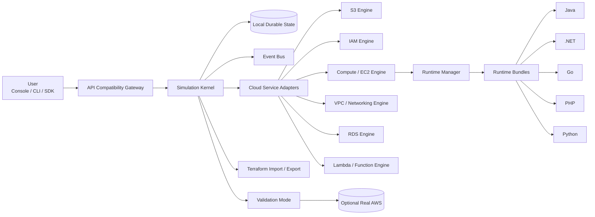
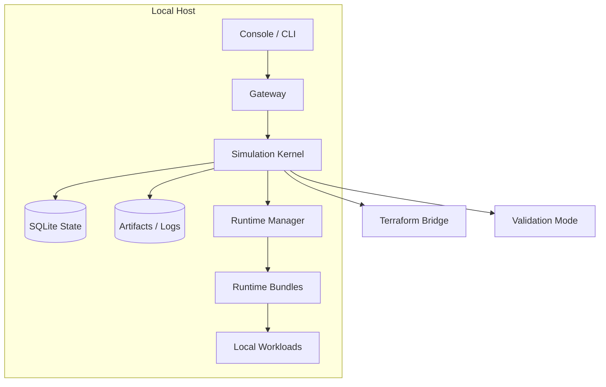

# CloudLearn Simulator - Low Level Design

## 1. Objective

CloudLearn is a local-first cloud simulator that gives users an AWS-like experience for learning, app validation, and workflow practice without requiring cloud hosting or cloud licenses. The simulator must:

- Run entirely on the user's machine.
- Persist simulator state locally across stop/start cycles.
- Expose AWS-compatible APIs for common workflows.
- Provide lightweight runtime environments for small applications.
- Allow later expansion to Azure and GCP through the same core model.

## 2. Design Principles

- Simulate the workflow, not the internal AWS implementation.
- Keep the core provider-neutral.
- Prefer lightweight local implementations over heavy infrastructure emulation.
- Make persistence first-class so workflows survive restart.
- Treat runtime environments as pluggable bundles.
- Keep AWS compatibility at the adapter boundary.
- Allow validation against real AWS as an optional mode.

## 3. Logical Architecture

## 4. Component Breakdown

### 4.1 UI and Client Entry Points

The user interacts through one or more of:

- Web console
- CLI wrapper
- AWS SDK compatible endpoints
- Local app deployment tooling

The UI should feel familiar to AWS users, but the backend can be custom and lightweight.

### 4.2 API Compatibility Gateway

This layer is responsible for:

- AWS-style routing
- SigV4-compatible request acceptance
- response formatting
- error translation
- pagination behavior
- region/account resolution
- request metadata and headers

It should not own domain state. It only maps incoming requests into simulation commands.

### 4.3 Simulation Kernel

The kernel is the central engine. It owns:

- resource lifecycle
- workflow orchestration
- region and account state
- dependency graphs
- latency and failure simulation
- event emission
- resume/replay behavior

The kernel should expose a small internal contract to service adapters and runtime bundles.

### 4.4 Local Durable State

All meaningful simulator state must be stored locally so the user can stop and start the simulator later without losing progress.

Recommended local storage:

- SQLite for structured state
- local filesystem for artifacts, uploads, and logs
- optional event log for workflow replay

State to persist:

- resource inventory
- workflow progress
- runtime bundle status
- region health
- simulated failures
- deployment artifacts
- user labs and progression

### 4.5 Cloud Service Adapters

Each cloud feature maps to a lightweight adapter:

- S3 adapter -> local object store or filesystem-backed bucket model
- IAM adapter -> simplified policy evaluator
- Compute adapter -> container/job runtime
- Networking adapter -> virtual routing and endpoint mapping
- RDS adapter -> local database container or embedded DB
- Lambda adapter -> sandboxed local process runner

The adapter boundary is where AWS-like API fidelity lives.

### 4.6 Runtime Manager

The runtime manager launches lightweight applications and wires them to simulated services.

Responsibilities:

- start and stop apps
- inject environment variables
- mount code and config
- expose local ports
- collect logs and health checks
- restart workloads after simulator recovery

### 4.7 Runtime Bundles

Language runtimes should be delivered as turnkey bundles that plug into the runtime manager.

Supported bundle types:

- Java
- .NET
- Go
- PHP
- Python

Each bundle should provide:

- startup templates
- package/build conventions
- health check behavior
- runtime image or sandbox config
- default environment contract
- logging convention

## 5. Key Workflows

### 5.1 Create Bucket

1. User calls AWS CLI, SDK, or console action.
2. API gateway normalizes the request.
3. Simulation kernel validates region, naming, and permissions.
4. S3 adapter creates the bucket record.
5. State is persisted locally.
6. UI receives event update.

### 5.2 Deploy Lightweight Application

1. User chooses a runtime bundle.
2. Runtime manager resolves the bundle.
3. Application code is packaged or mounted locally.
4. The runtime starts inside a local sandbox or container.
5. The app receives simulated cloud endpoints and credentials.
6. Logs and health status are streamed back to the UI.

### 5.3 Stop and Resume Simulator

1. Simulator stop signal arrives.
2. Kernel flushes state to SQLite and local artifact storage.
3. Runtime manager stops active workloads.
4. On restart, kernel reloads state.
5. Runtime manager restores workloads as required.
6. UI reconnects to the existing workflow state.

### 5.4 Validate Against Real AWS

1. User enables validation mode.
2. The same workflow is executed against AWS-compatible simulator endpoints and optional real AWS endpoints.
3. Responses, errors, and state changes are compared.
4. Differences are surfaced for training or verification.

### 5.5 Export to Terraform

1. Kernel serializes the current desired state.
2. Terraform bridge maps simulator resources to IaC.
3. Generated Terraform can be used for real cloud rollout later.
4. Import can also recreate simulator state from an IaC definition.

## 6. Data Model

### 6.1 Core Tables

- `accounts`
- `regions`
- `resources`
- `resource_versions`
- `workflow_runs`
- `workflow_steps`
- `runtime_instances`
- `runtime_bundles`
- `events`
- `artifacts`
- `validation_runs`
- `terraform_exports`

### 6.2 Resource Graph

Resources should be modeled as a dependency graph, not as disconnected records.

Examples:

- bucket -> objects
- role -> policy attachments
- instance -> subnet -> vpc
- app -> runtime bundle -> endpoints

This graph is what enables realistic stop/start, dependency failure, and recovery behavior.

## 7. Service Interfaces

### 7.1 Internal Kernel Contract

The internal contract should remain small:

- create resource
- update resource
- delete resource
- query resource
- emit event
- persist snapshot
- restore snapshot

### 7.2 Runtime Bundle Contract

Each runtime bundle should expose:

- `supports(language, framework)`
- `prepare(workload_spec)`
- `start(instance_spec)`
- `stop(instance_id)`
- `restart(instance_id)`
- `health(instance_id)`
- `logs(instance_id)`

## 8. Deployment View

## 9. Non-Goals

- Recreating all AWS internals.
- Building a distributed cloud control plane on day one.
- Implementing full IAM parity for every edge case.
- Simulating hardware-level VM behavior when a container or sandbox is enough.

## 10. Recommended v1 Stack

- Local backend: Python or Java, depending on current implementation path.
- Persistence: SQLite plus local files.
- Runtime layer: containers or sandboxes.
- API compatibility: AWS-style adapters per service.
- UI: React console.
- Terraform bridge: export/import translator.

## 11. Expansion Path

1. AWS-first simulator with S3, IAM, compute, and runtime bundles.
2. Add validation mode against real AWS.
3. Add Terraform export/import parity.
4. Add Azure provider profile.
5. Add GCP provider profile.

The core should remain the same while the provider skins and API adapters change.
