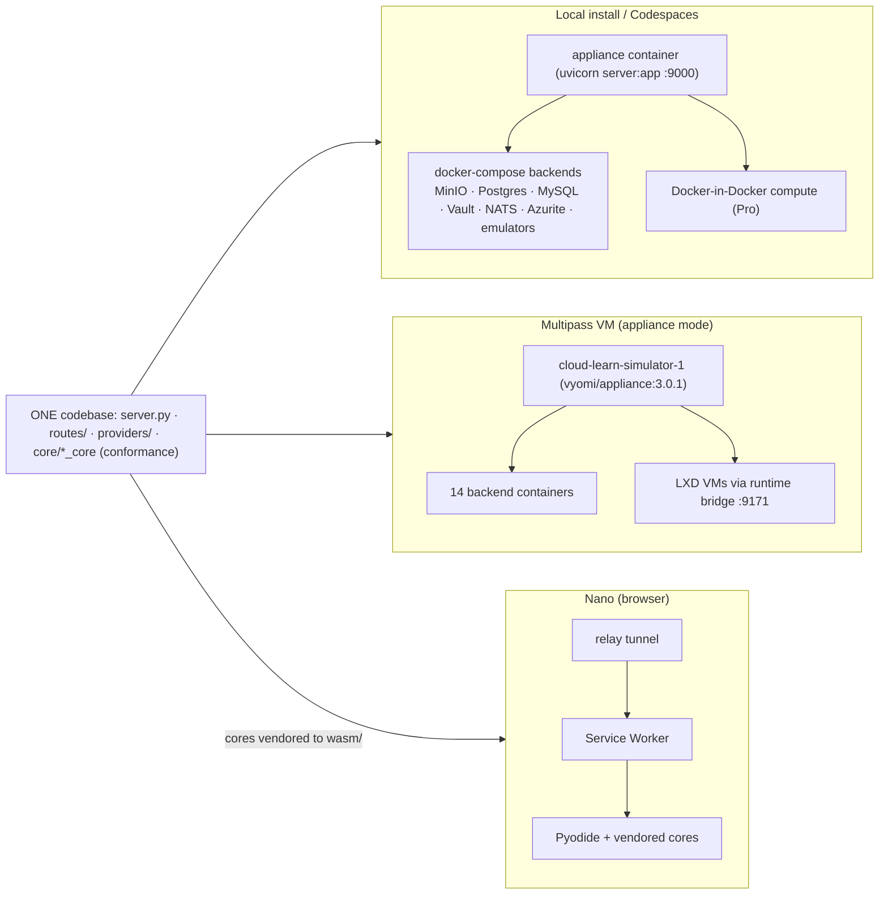

# Vyomi Appliance — Detailed Component Architecture

A full-blown component diagram of the appliance (v3.0.x). It shows the request
paths (console REST **and** native SDK/CLI wire), the provider + conformance-core
layers, the store **seams** with their in-memory vs real-backed implementations, the
real backends, the compute/runtime path, support systems, and the Nano/WASM substrate
that reuses the same cores. `console-next` (new UI) is marked PARKED (feature branch).

```mermaid
flowchart TB
  %% ─────────────────────────── CLIENTS ───────────────────────────
  subgraph CLIENTS["① Clients"]
    direction LR
    SDK["Native SDK / CLI<br/>boto3 · gcloud · az · terraform<br/>(SigV4 / ARM / REST wire)"]
    OLDUI["Browser — current consoles<br/>static/aws|gcp|azure-console.html"]
    NEWUI["console-next SPA<br/>(PARKED · feat/console-redesign)"]:::parked
    CLI["vyomi launcher CLI"]
  end

  %% ─────────────────────────── ENTRY ───────────────────────────
  subgraph ENTRY["② Entry — server.py · FastAPI app :9000"]
    direction TB
    APP["app = FastAPI()"]
    MW["ASGI middleware (core/middleware.py)<br/>TenantContext · HeaderAlias (X-CloudLearn↔X-Vyomi)<br/>CORS · GlassBoxCapture tap"]
    REG["registration loop<br/>routes/*.register(app) · providers register"]
    UIG{"VYOMI_UNIFIED_INGRESS?"}
    S3CATCH["S3 native-wire catch-all<br/>/{bucket}/{key:path} (registered last)"]
    DEVFLOW["device-flow / activation<br/>/api/auth/*-activation"]
  end

  %% ─────────────────────── CONSOLE REST ROUTES ───────────────────────
  subgraph ROUTES["③ Console REST route modules (routes/ + /api/* in server.py)"]
    direction LR
    R_S3["aws_s3 · /api/s3/*"]
    R_EC2["aws_ec2 · /api/ec2/*"]
    R_RDS["aws_rds · /api/rds/*"]
    R_DDB["aws_dynamodb · /api/dynamodb/*"]
    R_SQS["aws_sqs/sns · /api/sqs,/api/sns"]
    R_LAM["aws_lambda · /api/lambda/*"]
    R_NET["aws_vpc · aws_apigw"]
    R_GCP["gcp_console · /api/gcp/*"]
    R_AZ["azure_console · /api/azure/*"]
    R_MISC["cloudsim · spaces · tenants<br/>config · licensing · runtime · terraform<br/>lazy_backends · shared"]
    R_NEXT["console_next · /console-next + /api/console/*<br/>(PARKED)"]:::parked
  end

  %% ─────────────────────── PROVIDER LAYER ───────────────────────
  subgraph PROV["④ Provider registries (providers/)"]
    direction LR
    P_REG["registry.py<br/>CloudProvider seam + register()"]
    P_AWS["aws.py + aws_ec2_routes"]
    P_GCP["gcp.py + gcp_routes + gcp_compute_routes"]
    P_AZ["azure.py + azure_services + azure_arm_core"]
    P_CAT["catalogs + capabilities<br/>aws/gcp/azure-catalog · fixtures"]
  end

  %% ─────────────────────── UNIFIED WIRE INGRESS ───────────────────────
  subgraph WIRE["⑤ Native wire ingress (opt-in · VYOMI_UNIFIED_INGRESS)"]
    direction TB
    WI["core/wire_ingress.py<br/>build_backed_router() · mount()"]
    AWR["core/aws_wire_router.py<br/>SigV4 cred-scope → X-Amz-Target → core"]
  end

  %% ─────────────────────── CONFORMANCE CORES ───────────────────────
  subgraph CORES["⑥ Conformance cores (core/*_core.py) — substrate-free, same logic on every substrate"]
    direction TB
    subgraph CORES_AWS["AWS cores"]
      direction LR
      C_S3["s3_core"]
      C_DDB["dynamodb_core"]
      C_RDS["rds_core · rds_data_core"]
      C_MSG["sqs_core · sns_core"]
      C_KMS["kms_core"]
      C_SEC["secrets_core"]
      C_IAM["iam_core (AuthZ eval)"]
      C_NET["vpc_core · apigateway_core"]
      C_LAM["lambda_core · eventbridge_core"]
    end
    subgraph CORES_GCP["GCP cores"]
      direction LR
      G_STG["gcp_storage_core"]
      G_SQL["gcp_cloudsql_core"]
      G_FS["gcp_firestore_core"]
      G_PS["gcp_pubsub_core"]
      G_SEC["gcp_kms_core · gcp_secretmanager_core"]
      G_IAM["gcp_iam_core"]
    end
    subgraph CORES_AZ["Azure cores"]
      direction LR
      A_BLOB["azure_blob_core · azure_queue_core"]
      A_SQL["azure_sql_core · azure_cosmos_core"]
      A_SB["azure_servicebus_core"]
      A_KV["azure_keyvault_secrets/keys_core"]
      A_IAM["azure_iam_core"]
      A_ARM["azure_arm_core (ARM dispatcher)"]
    end
  end

  %% ─────────────────────── STORE SEAMS ───────────────────────
  subgraph SEAMS["⑦ Store seams (core/) — in-memory default ⟷ real-backed impl"]
    direction LR
    S_OBJ["ObjectStore<br/>InMemory ⟷ MinioBackedObjectStore / minio_mirror"]
    S_SQL["SqlStore<br/>sqlite ⟷ PostgresBackedSqlStore"]
    S_NOSQL["NoSqlStore<br/>InMemory ⟷ Persistent* (SQLite)"]
    S_KV["KvStore / KeyStore<br/>InMemory ⟷ VaultBacked*"]
    S_MSG["MessagingStore<br/>InMemory ⟷ NatsBackedMessagingStore"]
    S_IAM["IamStore<br/>InMemory (principals + policies)"]
    STATE["app_context.py<br/>in-memory state proxies (space-scoped)"]
  end

  %% ─────────────────────── COMPUTE / RUNTIME ───────────────────────
  subgraph COMPUTE["⑧ Compute / runtime"]
    direction TB
    CB["core/compute · ComputeBackend ABC<br/>DockerComputeBackend / LXD / Multipass"]
    VMC["vm_connect.py<br/>SSH key inject · lxc proxy · connect-info"]
    BRIDGE["runtime bridge<br/>CLOUDLEARN_RUNTIME_BRIDGE_URL :9171"]
    PROV2["backend_provisioner.py<br/>lazy backend recipes"]
  end

  %% ─────────────────────── REAL BACKENDS ───────────────────────
  subgraph BACKENDS["⑨ Real backends (containers / host)"]
    direction LR
    B_MINIO["MinIO (S3/GCS bytes)"]
    B_PG["Postgres (RDS/CloudSQL/AzureSQL)"]
    B_MYSQL["MySQL"]
    B_AZURITE["Azurite (Azure Blob)"]
    B_FS["Firestore emulator"]
    B_PS["Pub/Sub emulator"]
    B_VAULT["Vault (KMS/Secrets Transit+KV)"]
    B_EMQ["ElasticMQ (SQS)"]
    B_NATS["NATS JetStream"]
    B_LXD["LXD / Multipass / Docker (VMs)"]
    B_CSIM["cloudsim service :9010<br/>(cost/usage sim)"]
    B_PORTAL["Vyomi Portal<br/>(license JWKS · activation · install telemetry)"]
  end

  %% ─────────────────────── SUPPORT SYSTEMS ───────────────────────
  subgraph SUPPORT["⑩ Support systems (core/)"]
    direction LR
    LIC["license + jwt_signer + license_remote<br/>tier JWT · activation"]
    TIER["tier_policy.py<br/>category gating"]
    TEL["install_registration.py<br/>phone-home telemetry (cc geo)"]
    TEN["shared_tenancy.py<br/>cohort / namespace isolation"]
    CSIM["cloudsim · cost/usage meter (→ :9010 service)"]
    GLASS["glassbox.py · call-event ring buffer + SSE"]
    PERSIST["persist_state / load_state · integrity · security_audit"]
  end

  %% ─────────────────────── NANO / WASM ───────────────────────
  subgraph NANO["⑪ Nano substrate (wasm/) — same cores, in-browser"]
    direction TB
    NBOOT["nano-boot.js · Pyodide boot"]
    NSW["sw.js · fetch→Pyodide ASGI shim"]
    NCORES["wasm/core/* (vendored cores via build_cores.py)<br/>+ aws_wire_router"]
    NADAPT["wasm/providers/*_adapter.py"]
    NRELAY["wasm/relay/* · external SDK ↔ tab tunnel"]
    NFIX["fixtures (build_fixtures.py)"]
  end

  %% ───────────────────────── EDGES ─────────────────────────
  OLDUI -->|/api/*| ROUTES
  NEWUI -.->|/api/console/* + native| ROUTES
  SDK -->|SigV4 / ARM / REST| ENTRY
  CLI --> ENTRY

  ENTRY --> REG --> ROUTES
  ENTRY --> UIG
  UIG -->|off| S3CATCH --> P_AWS
  UIG -->|on| WI
  SDK -->|native wire| UIG

  ROUTES --> PROV
  ROUTES --> STATE
  R_S3 --> STATE
  R_RDS --> STATE
  R_DDB --> STATE
  R_SQS --> STATE
  R_EC2 --> CB

  PROV --> P_CAT
  P_AWS --> CORES
  P_GCP --> CORES
  P_AZ --> CORES

  WI --> AWR --> CORES
  WI --> SEAMS

  C_S3 --> S_OBJ
  C_DDB --> S_NOSQL
  C_RDS --> S_SQL
  C_MSG --> S_MSG
  C_KMS --> S_KV
  C_SEC --> S_KV
  C_IAM --> S_IAM

  %% GCP + Azure cores share the SAME seams (one seam per capability, cross-cloud)
  G_STG --> S_OBJ
  G_SQL --> S_SQL
  G_FS --> S_NOSQL
  G_PS --> S_MSG
  G_SEC --> S_KV
  A_BLOB --> S_OBJ
  A_SQL --> S_SQL
  A_SQL --> S_NOSQL
  A_SB --> S_MSG
  A_KV --> S_KV

  S_OBJ -->|backed| B_MINIO
  S_SQL -->|backed| B_PG
  S_SQL -.-> B_MYSQL
  S_NOSQL -.-> B_FS
  S_NOSQL -.-> B_PS
  S_KV -->|backed| B_VAULT
  S_MSG -->|backed| B_NATS
  S_MSG -.-> B_EMQ
  R_AZ -.-> B_AZURITE

  CB --> BRIDGE --> B_LXD
  CB --> VMC
  REG --> PROV2 --> BACKENDS

  ENTRY --> DEVFLOW --> LIC
  LIC -.->|JWKS / activate| B_PORTAL
  TEL -.->|phone-home| B_PORTAL
  ROUTES --> TIER
  ROUTES --> TEN
  ROUTES --> CSIM --> B_CSIM
  MW --> GLASS
  SDK -.-> TEL
  STATE --> PERSIST

  %% Nano reuses the SAME cores
  NEWUI -.->|browser substrate| NSW
  OLDUI -.->|Nano mode| NSW
  NSW --> NBOOT --> NCORES
  NCORES --- CORES
  NSW --> NADAPT --> NCORES
  NRELAY --> NSW
  NFIX --> NSW
  SDK -.->|via relay| NRELAY

  classDef parked stroke-dasharray:4 3,stroke:#888,color:#888;
```



## Topology — the three substrates (one codebase)



## Notes
- **Two request paths converge on the same cores:** the **console REST** routes (what the UI calls) and the **native SigV4/ARM/REST wire** (what real SDKs call). Today the console REST writes to in-memory `app_context` state; the **backed stores** (MinIO/Postgres/Vault/NATS) are hit by the wire path when `VYOMI_UNIFIED_INGRESS` is on. Unifying those is the parked backed-store work.
- **Compute is already real:** EC2/GCE/AzureVM create → `ComputeBackend` → runtime bridge → a real **LXD** container.
- **Nano = same cores, different transport:** the Service Worker is the ASGI shim; Pyodide runs the *vendored* conformance cores; the relay tunnels external SDKs into the tab. No fork of the service logic.
- **One seam per capability, shared across clouds:** the AWS, GCP and Azure cores for the *same capability* resolve to the **same store seam** — e.g. `s3_core`, `gcp_storage_core`, `azure_blob_core` all land on `ObjectStore`→MinIO; `rds_core`/`gcp_cloudsql_core`/`azure_sql_core` on `SqlStore`→Postgres; `sqs/sns_core`, `gcp_pubsub_core`, `azure_servicebus_core` on `MessagingStore`→NATS. The cloud-specific wire fidelity lives in the core; the storage is unified underneath.
- **Glass-box capture ships in main:** `GlassBoxCaptureMiddleware` (core/middleware.py) taps every request into the `glassbox.py` ring buffer + SSE stream. The console-next *Inspector widget* that visualizes it is what's parked — the capture backbone is live.
```
