# Vyomi - Full Simulator Architecture

## 1. Product Definition

Vyomi is a local-first, multi-space cloud simulation platform built on a CloudSim backbone and a VM-like LXD runtime layer. It gives users AWS-like, GCP-like, Azure-like, OCI-like, and Tencent-like experiences on their own machine while keeping the simulation boundary local.

It is designed to:

- simulate cloud workflows with realistic cloud physics,
- keep multiple isolated simulation spaces running in parallel,
- persist all simulator state on the user's device,
- expose provider-specific APIs and UI experiences through the control plane,
- provide VM-like runtime environments where users can SSH in and deploy their own applications,
- support inter-space and intercloud federation workflows,
- export and import infrastructure through Terraform,
- add certification exercises and scoring,
- and later extend to additional cloud providers using the same substrate.

The simulator is not a copy of any public cloud internals. It is a provider-aware experience layer backed by a provider-neutral simulation kernel.

## 2. Architectural Principles

- Local-first: the simulator must work without cloud hosting.
- Persistent: state survives stop and start.
- Provider-neutral backbone: CloudSim owns the cloud physics and scheduling model.
- Provider-specific control plane: IAM, API, and UI behavior belong to the provider adapter layer.
- Multi-space: multiple simulation spaces can coexist and keep running in the background.
- VM-like runtime layer: LXD provides the user-facing machine experience.
- Federation-aware: same-cloud and cross-cloud workflows must be first-class.
- Modular: services, provider adapters, and runtime bundles must be pluggable.
- Secure by design: signing, entitlement, tamper detection, and local lockout are part of the platform.
- Resource-aware: the control plane must estimate RAM, disk, and runtime overhead before creating new spaces.

## 3. Top-Level System View

```mermaid
flowchart TB
    U[User] --> UI[Console / CLI / SDK]
    UI --> CP[Python Control Plane]
    CP --> SR[Simulation Space Registry]
    CP --> ASM[Active Space Manager]
    CP --> EST[Local Cost Estimator]
    CP --> GW[API Compatibility Gateway]
    CP --> IAM[IAM / Policy Engine]
    CP --> FM[Federation Manager]
    CP --> EVT[Event Bus]
    CP --> CORE[Simulation Kernel]
    CP --> STATE[(Local Durable State)]
    CP --> ADAPTERS[Cloud Service Adapters]
    CP --> VAL[Validation Mode]
    CORE --> K1[CloudSim Runtime A]
    CORE --> K2[CloudSim Runtime B]
    CORE --> K3[CloudSim Runtime C]
    CP --> RT[LXD Runtime Manager]
    RT --> PROJECTS[LXD Projects / Instance Sandboxes]
    RT --> IMAGES[OS Images / Runtime Bundles]
    ADAPTERS --> AWS[AWS Space]
    ADAPTERS --> GCP[GCP Space]
    ADAPTERS --> AZ[Azure Space]
    ADAPTERS --> OCI[OCI / Tencent Spaces]
    FM --> LINKS[Federation Links / Workflows]
    VAL --> RW[Optional Real Cloud Validation]
    CP --> TF[Terraform Bridge]
    CP --> CERT[Certification Engine]
    CP --> GH[GitHub Integration Layer]
    CP --> ENT[Entitlement and Credit Layer]
    CP --> OBS[CloudWatch / Observability]
    IMAGES --> JAVA[Java]
    IMAGES --> DOTNET[.NET]
    IMAGES --> GO[Go]
    IMAGES --> PHP[PHP]
    IMAGES --> PY[Python]
    RT --> HOST[LXD Host]
```

## 4. Control Plane

The control plane is the local application that the user installs and launches. It owns:

- UI rendering
- request routing
- simulation space registry
- active space switching
- provider-specific IAM, API, and UI behavior
- simulator orchestration
- local persistence
- lifecycle management
- entitlement enforcement
- local cost estimation and space caps
- workflow state
- certification tracking
- source-control deployment flow
- federation orchestration
- runtime management

The control plane should stay thin in cloud substrate logic. It should delegate cloud physics to CloudSim, runtime execution to LXD, and provider behavior to adapters.

## 5. Simulation Kernel

The kernel is the source of truth for simulation state within a given space. It manages:

- accounts, regions, and provider-scoped naming
- resource graph per simulation space
- workflow execution
- latency and failure simulation
- region outages and recovery
- object, queue, function, database, and instance lifecycles
- event emission
- snapshot creation and restore
- transition validation
- federation link state
- reconciliation between desired state and runtime state
- simulation tick progression
- local cost accounting

The kernel should expose a small internal API:

- `create_resource`
- `update_resource`
- `delete_resource`
- `query_resource`
- `record_event`
- `save_snapshot`
- `restore_snapshot`
- `evaluate_policy`
- `check_entitlement`
- `advance_tick`
- `attach_federation_link`
- `detach_federation_link`
- `estimate_space_cost`

## 6. Local Persistence

All user-visible state must persist locally.

Recommended storage layout:

- SQLite for structured records
- local files for artifacts, uploads, logs, and runtime volumes
- event log for workflow history
- snapshot table for restart
- encrypted store for license and identity tokens
- per-space namespace directories
- per-space runtime and LXD project metadata

State persisted locally:

- simulator configuration
- simulation space registry
- active space context
- account and region inventories
- cloud resources
- runtime instances
- uploaded artifacts
- workflow runs
- certification attempts
- credit usage
- entitlement decisions
- lockout events
- GitHub integration tokens
- federation definitions and traces
- capacity and cost estimates
- space snapshots and replay checkpoints

## 7. API Compatibility Layer

The API layer exposes provider-specific endpoints and request shapes. Its job is to:

- accept AWS CLI and SDK traffic,
- accept GCP, Azure, OCI, and Tencent-specific calls through provider adapters when enabled,
- normalize request parameters,
- validate documented inputs,
- produce provider-like responses,
- convert internal errors into provider-like errors,
- preserve common headers and metadata,
- route to the correct service adapter, region, and simulation space,
- inject the active space context into the request lifecycle.

The compatibility layer should not own business state.

## 8. Entitlements, Credits, and Lockout

Vyomi uses a capability system to gate premium features.

Plan tiers:

- Free
- Pro
- Max
- Enterprise

The entitlement layer decides:

- what a user can access,
- how many credits are available,
- which services are enabled,
- which labs are unlocked,
- whether validation mode is allowed,
- whether multi-region is allowed,
- whether certification mode is allowed.
- how many simulation spaces may be created,
- whether federation features are enabled,
- whether provider packs are unlocked,
- whether local resource budgets are exceeded.

Security model:

- licenses are signed,
- bundles are signed,
- tamper detection can quarantine the client,
- only a cloud-issued unlock can release a locked installation,
- the local client caches valid entitlements for offline use when allowed.

## 9. Runtime Layer

The runtime layer exists to run lightweight applications locally and to present a VM-like user experience. It should support:

- source-based deployment,
- artifact-based deployment,
- sandbox-based execution,
- LXD-backed VM-like execution,
- local ports and network exposure,
- environment variable injection,
- simulated cloud metadata,
- logs and health checks,
- lifecycle operations.

The runtime layer must also support SSH and SCP access for machine-like EC2 usage.

## 10. Runtime Bundles

Each language runtime is a bundle that plugs into the runtime manager. OS-image bundles are required for VM-like EC2 spaces.

Supported bundle types:

- OS image bundles for VM-like EC2 spaces
- Java
- .NET
- Go
- PHP
- Python

Each runtime bundle should provide:

- build template,
- startup command,
- health checks,
- default ports,
- packaging rules,
- dependency handling,
- log conventions,
- restart behavior.

The runtime manager should call a common interface:

- `supports(language, framework)`
- `prepare(workload_spec)`
- `start(instance_spec)`
- `stop(instance_id)`
- `restart(instance_id)`
- `logs(instance_id)`
- `health(instance_id)`

The LXD runtime manager should additionally provide:

- `create_project(space_id)`
- `delete_project(space_id)`
- `create_instance(space_id, os_image, flavor)`
- `delete_instance(space_id, instance_id)`
- `snapshot_instance(space_id, instance_id)`
- `restore_instance(space_id, snapshot_id)`
- `attach_network(space_id, instance_id, network_spec)`
- `attach_storage(space_id, instance_id, storage_spec)`

## 11. GitHub Deployment Layer

Users can connect GitHub to deploy code into simulated environments.

The integration layer should:

- authorize repository access,
- browse repos and branches,
- resolve commits and tags,
- fetch source,
- build or package locally,
- deploy into the selected runtime bundle,
- track deployment history,
- support rollback.

Use GitHub App or scoped OAuth tokens, stored securely on the local machine.

## 12. Certification Engine

Certification exercises are first-class product content.

The certification engine should:

- define labs and exam scenarios,
- track steps and expected outcomes,
- score user actions,
- enforce timing rules,
- store progress locally,
- support hint modes and exam modes,
- verify completion against hidden rules.

Exercise packs should be versioned and pluggable.

## 13. AWS Validation Mode

Validation mode allows the same workflow to be compared against real AWS.

This mode should:

- remain optional,
- compare request and response shapes,
- compare state transitions,
- surface differences,
- support lightweight application verification.

It is a compatibility aid, not the default runtime.

Validation mode should remain optional and must not change the active space lifecycle or the local simulation contract.

## 14. Terraform Bridge

Terraform is the portability bridge between the simulator and real cloud.

The bridge should:

- export simulator state to Terraform,
- import Terraform into simulator state,
- map simulator resources to IaC resources,
- preserve desired state across local and cloud workflows.

## 15. Service Architecture

The simulator should implement provider-like service families through lightweight adapters and runtime backends that sit on top of CloudSim and LXD.

### 15.1 S3

Purpose:
- object storage simulator within an active simulation space.

Back end:
- local filesystem or embedded object store.

State model:
- buckets, objects, versions, metadata, tags, multipart uploads.

Core behaviors:
- create and delete bucket,
- upload and download object,
- list objects with prefix and delimiter,
- versioning,
- tagging,
- multipart upload,
- copy object,
- range requests,
- batch delete.

### 15.2 IAM

Purpose:
- identity and access simulator. IAM and policy enforcement live in the control plane and are provider-specific.

Back end:
- simplified policy and principal evaluator.

State model:
- users, groups, roles, policies, sessions, attachments.

Core behaviors:
- create identities,
- attach policies,
- simulate role assumption,
- evaluate allow/deny,
- support read-only and restricted personas.

### 15.3 EC2

Purpose:
- compute instance simulator with VM-like access.

Back end:
- CloudSim VM placement plus LXD runtime sandbox.

State model:
- instances, AMI template, key pair, security groups, volumes, metadata, state transitions.

Core behaviors:
- launch instance,
- pending to running transition,
- stop, start, reboot, terminate,
- assign IP,
- expose metadata service,
- surface console output,
- attach volumes,
- restart workloads,
- allow SSH and SCP into the sandbox.

### 15.4 VPC

Purpose:
- networking and boundary simulator scoped to the active space.

Back end:
- network policy and endpoint mapping.

State model:
- VPC, subnet, route table, security group, endpoint, peering, gateway.

Core behaviors:
- create network boundaries,
- attach instances and services,
- apply ingress and egress rules,
- simulate public/private routing,
- support multi-region connectivity concepts.

### 15.5 RDS

Purpose:
- relational database simulator scoped to the active space.

Back end:
- local PostgreSQL, SQLite, or containerized DB.

State model:
- DB instance, parameter group, subnet group, credentials, snapshot, backup.

Core behaviors:
- create database,
- start and stop,
- connect through endpoint,
- snapshot and restore,
- parameter and version selection.

### 15.6 Lambda

Purpose:
- function-as-a-service simulator scoped to the active space.

Back end:
- sandboxed local process or container.

State model:
- function, handler, runtime, memory, timeout, env vars, triggers.

Core behaviors:
- deploy function,
- invoke,
- log output,
- timeout and error behavior,
- event triggers.

### 15.7 SQS / SNS

Purpose:
- queue and pub/sub simulator scoped to the active space.

Back end:
- local message broker or in-memory queue store.

State model:
- queue, topic, subscription, message, delivery attempt.

Core behaviors:
- enqueue and receive,
- publish and subscribe,
- FIFO behavior where needed,
- visibility timeout,
- retries and fan-out.

### 15.8 CloudWatch / Observability

Purpose:
- logs, metrics, and alarms scoped to the active space.

Back end:
- event store and metrics tables.

State model:
- log groups, streams, metrics, alarms, dashboards.

Core behaviors:
- ingest logs,
- query metrics,
- trigger alarms,
- display dashboards,
- support instance and app health views.

### 15.9 CloudFormation

Purpose:
- infrastructure template simulator.

Back end:
- template parser and resource graph applier.

State model:
- stacks, change sets, stack events, outputs.

Core behaviors:
- create stack,
- update stack,
- rollback,
- parameterization,
- dependency ordering.

### 15.10 Containers and Registry

Purpose:
- container and registry-aligned workflows when needed by a provider profile.

Back end:
- local container engine integration.

State model:
- image, repository, task definition, service, cluster, deployment.

Core behaviors:
- push and pull image,
- run task,
- deploy service,
- update image,
- rolling replacement.

### 15.11 API Gateway / Route 53 / Edge

Purpose:
- entrypoint and routing simulator scoped to the active space.

Back end:
- local gateway router and DNS-like mapping.

State model:
- API, route, domain, DNS record, stage, endpoint.

Core behaviors:
- route traffic,
- map custom domains,
- stage deployment,
- direct requests to local services.

## 16. Service Catalog View

The simulator should present a catalog of capabilities rather than exposing every internal implementation detail.

Catalog model:

- service family,
- resource types,
- workflow templates,
- credit cost,
- entitlement tier,
- certification support,
- runtime dependency,
- active simulation space,
- runtime backing type,
- validation support,
- federation compatibility.

## 17. EC2 Runtime Mapping

EC2 simulation should map to local LXD runtime templates while CloudSim manages placement and capacity.

Example:

- target OS: Amazon Linux 2023
- runtime stack: Java 21
- app: Spring Boot

The simulator creates:

- an EC2 instance record,
- a matching LXD instance or VM-like guest,
- a local storage attachment,
- metadata service,
- network policy,
- startup hooks,
- console output stream,
- SSH and SCP access endpoint.

## 18. Installer and Packaging Layer

The simulator should be distributable with native installers.

Targets:

- macOS package or signed disk image,
- Windows installer,
- Linux deb or rpm,
- optional AppImage for portable Linux installs.

Installer responsibilities:

- lay down binaries,
- create local data directories,
- initialize state store,
- configure updates,
- register background service,
- create desktop shortcuts if needed.

## 19. Docker Compose Deployment Mode

The simulator should also be runnable as a Docker Compose stack for users who want a fast local launch path without native installers.

Compose mode should include:

- control plane service,
- API gateway service,
- persistence volume,
- runtime manager service,
- optional UI service,
- optional runtime backend containers,
- optional supporting services such as a local database or queue.

Compose mode should support:

- `docker compose up`,
- local state volumes,
- stop and start without losing workflows,
- service replacement during development,
- portable demos and sandboxes,
- quick onboarding for technical users.

Compose is a supported deployment profile, not the only product form.

## 20. Expansion Path

The core must be reusable for multiple providers and multiple simulation spaces per provider.

Expansion order:

1. AWS core services.
2. Multi-space simulation and active-space switching.
3. Federation and cross-space workflows.
4. Certification and validation.
5. Terraform import/export.
6. GitHub deployment.
7. Azure provider profile.
8. GCP provider profile.

The provider-neutral core should remain stable while adapters and UI skins change.

## 21. Non-Goals

- Recreate all AWS internal implementation details.
- Build a public cloud control plane.
- Depend on cloud hosting for the simulator to work.
- Model every obscure edge case of every cloud API on day one.
- Merge simulation spaces into one global state.
- Make space switching stop runtimes implicitly.
- Use Docker as the primary VM abstraction when LXD is available.

## 22. Summary

Vyomi is best implemented as:

- a local control plane,
- a persistent simulation kernel,
- CloudSim as the cloud substrate,
- LXD as the VM-like runtime layer,
- provider-specific adapters for IAM, API, and UI behavior,
- multiple isolated simulation spaces,
- federation and connected workflows,
- runtime bundles for app execution,
- certification and credit systems,
- GitHub source deployment,
- Terraform translation,
- secure licensing and lockout,
- and a provider-neutral core for future Azure, GCP, OCI, and Tencent support.

## 23. API-Driven Action Model

Every visible simulator operation should map to a documented cloud API action.

Design rule:

- Console button -> API action
- CLI call -> same API action
- SDK call -> same API action
- Lab and certification step -> same API action

The UI should never bypass the API layer. This keeps the simulator familiar to users and keeps future service additions consistent.

The active simulation space must also flow through the API layer so every action is scoped correctly.

## 24. Lightweight Engine Strategy

To avoid a massive codebase, the simulator should reuse a small set of shared engines:

- Resource graph engine
- Lifecycle engine
- Policy engine
- Network topology engine
- Runtime engine
- Event engine
- Persistence engine

Services become thin adapters over these engines. That means S3, IAM, EC2, VPC, Lambda, queues, observability, and template deployment all reuse the same core mechanics.

CloudSim owns the placement and timing layer, and LXD owns the machine-like runtime layer.

## 25. Network Simulation Model

VPC, subnets, availability zones, security groups, route tables, internet gateways, and NAT should all be simulated as a logical network model.

Key points:

- A VPC is a logical boundary.
- A subnet is a placement and reachability scope.
- An availability zone is a fault domain and scheduler label.
- A security group is a stateful rule set.
- A route table decides logical traffic flow.

The simulator should enforce these rules at the service gateway and runtime boundary, not by trying to build a real cloud network.

Federation links should sit above the network model and connect entire simulation spaces with explicit trust and latency rules.

## 26. Master Layered Architecture

The complete platform stack should be understood as the following layers:

- Experience layer: console, CLI, SDK, labs, certification UI.
- API contract layer: documented cloud actions, request and response shapes.
- Routing layer: service dispatch, region selection, account resolution, active space selection.
- Simulation kernel: resource graph, lifecycles, workflows, events, snapshots, and federation links.
- Shared engines: policy, topology, runtime, persistence, and event handling.
- Service adapter layer: S3, IAM, EC2, VPC, RDS, Lambda, queues, observability, templates, containers, edge.
- Runtime bundle layer: OS images, Java, .NET, Go, PHP, Python.
- Local host layer: LXD projects, sandboxes, local ports, mounted storage, startup hooks.
- Persistence layer: SQLite, artifact storage, encrypted tokens, snapshots, audit history, per-space namespaces.
- Governance layer: credits, tiers, certification, GitHub deploy, Terraform bridge, real cloud validation, lockout, and local resource caps.

That layered view is the master architecture used for design, implementation, certification planning, and future provider expansion.

## 27. Capability Pack System

Capabilities should be delivered as signed packs that are downloaded and activated on demand.

Pack types:

- service packs
- runtime packs
- exercise packs
- provider packs

Pack lifecycle:

- discover from a remote registry
- check entitlement and credits
- download the signed artifact
- verify signature and compatibility
- activate locally
- cache for offline reuse
- update or roll back by version

Pack contents should include:

- manifest
- adapter or runtime code
- API schemas
- UI metadata
- state model
- tests and fixtures
- signature metadata
- space scoping metadata
- federation compatibility metadata

## 28. Pack Admission Rules

Every capability pack must include provider-like API support in the MVP and beyond.

A pack should be rejected unless it provides:

- documented actions
- request schemas
- response schemas
- error mappings
- state transition rules
- pagination and region behavior where relevant
- space scoping behavior
- federation compatibility where relevant

Admission checks should include:

- signature validation
- version compatibility
- entitlement validation
- API contract validation
- schema validation
- optional contract tests
- local resource estimate validation

## 29. Cloud-Agnostic Pack Design

Capability packs should be cloud-agnostic by design so the same capability can extend from AWS to Azure and GCP.

The pack should contain:

- a provider-neutral capability core
- provider adapters
- provider profiles
- space lifecycle hooks
- federation hooks

The provider-neutral core owns:

- resource model
- lifecycle
- workflow logic
- local persistence shape
- events and validation

Provider adapters own:

- API names
- terminology
- request and response mapping
- region and zone semantics
- console labels

AWS is the first provider profile. Azure and GCP should be added later through the same pack contract.

## 30. MVP Scope

The MVP should include the smallest useful set of capabilities while keeping the architecture extensible.

MVP must include:

- local control plane
- provider-style API-driven actioning
- local durable state
- Docker Compose deployment mode
- Free tier simulator support
- signed entitlement and license flow
- capability packs with provider-like API contract validation
- lazy activation of services
- multi-space registry and active-space switching
- local RAM/disk estimation and max-space enforcement
- CloudSim-backed cloud physics
- LXD-backed VM-like runtime for EC2
- federation primitives for same-provider and cross-provider workflows
- S3
- IAM basics
- EC2 basics backed by a local VM-like runtime
- VPC basics with subnet, security group, route, and AZ labels
- one runtime bundle path, starting with Python
- GitHub deploy into local runtime
- basic certification exercises
- tier and credit gating

MVP should defer:

- full service catalog depth
- RDS
- Lambda
- SQS / SNS
- CloudWatch
- CloudFormation
- AWS validation mode
- Terraform import/export at scale
- Azure and GCP provider packs
- advanced multi-region behavior
- distributed execution beyond the local machine

## 31. Architecture Decisions

The platform should follow these explicit decisions:

1. CloudSim is the provider-neutral simulation backbone.
2. LXD is the default VM-like runtime layer for EC2-style machine access.
3. The control plane owns provider-specific IAM, API contracts, and UI behavior.
4. Multiple simulation spaces per provider are first-class and may run in parallel.
5. Switching the active space never stops any background simulation runtime.
6. Same-provider and cross-provider federation are both supported.
7. Local RAM, disk, and runtime estimates must gate space creation.
8. Provider-specific service adapters sit on top of the shared kernel, not inside CloudSim.
9. EC2-style usage should favor SSH and SCP into a sandboxed guest over sample-app shortcuts.
10. The first implementation slice should expose the space registry, active-space switch, and CloudSim summary APIs before deeper provider overlays.
