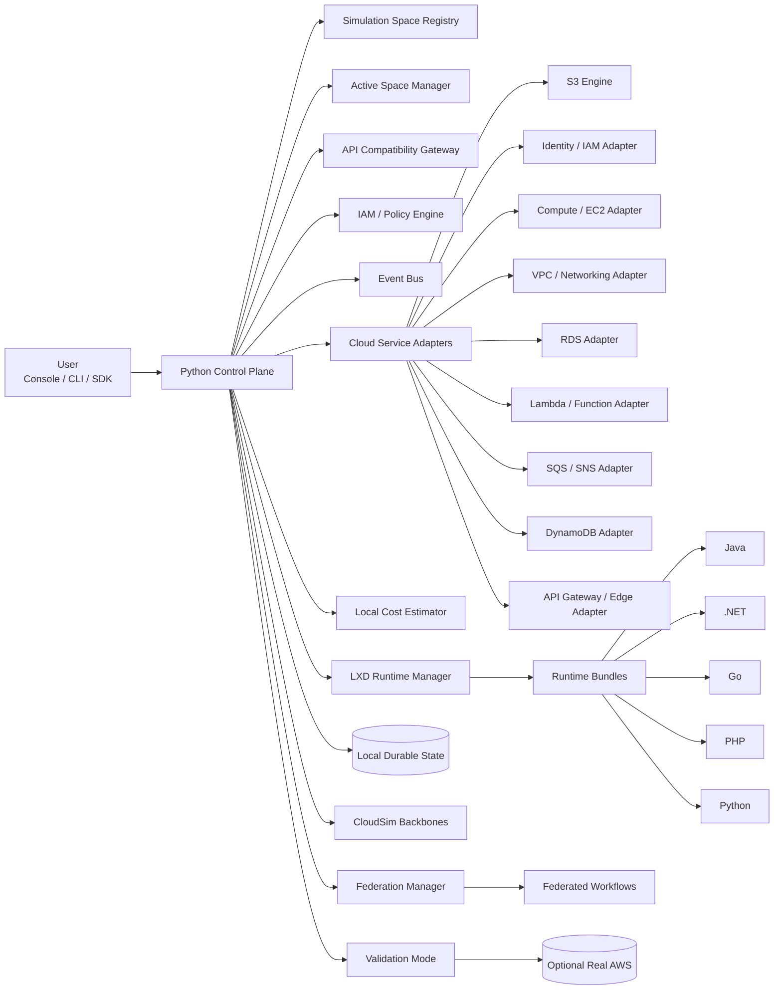
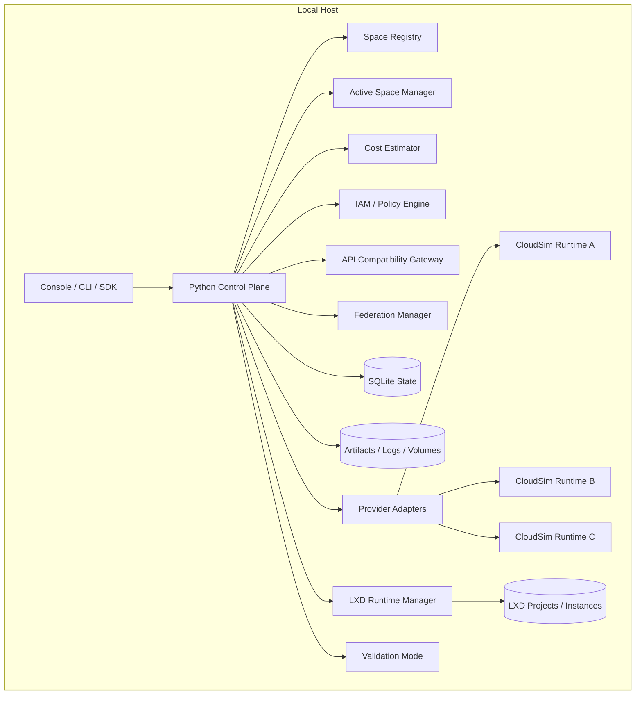

# Vyomi Simulator - Low Level Design

## 1. Objective

Vyomi is a local-first, multi-space cloud simulator that gives users an AWS-like, GCP-like, Azure-like, and future multi-cloud experience for learning, app validation, workflow practice, and intercloud federation without requiring cloud hosting or cloud licenses. The simulator must:

- Run entirely on the user's machine.
- Persist simulator state locally across stop/start cycles.
- Expose AWS-compatible APIs for common workflows.
- Provide lightweight VM-like runtime environments for user-deployed applications.
- Support multiple concurrent simulation spaces per provider.
- Allow later expansion to Azure, GCP, OCI, and Tencent through the same core model.
- Support inter-space and intercloud federation workflows.

## 2. Design Principles

- Simulate the workflow, not the internal AWS implementation.
- Keep the core provider-neutral and CloudSim-backed.
- Use CloudSim as the local cloud backbone for placement, scheduling, timing, and failure simulation.
- Keep the control plane responsible for provider-specific IAM, API contracts, and UI experience.
- Prefer lightweight local runtime sandboxes over heavy infrastructure emulation.
- Make persistence first-class so workflows survive restart.
- Treat runtime environments as pluggable OS-backed sandboxes.
- Allow multiple isolated simulation spaces to coexist and continue running in the background.
- Allow inter-space and intercloud federation for connected workflows and tests.
- Keep AWS compatibility at the adapter boundary.
- Allow validation against real AWS as an optional mode.

## 3. Logical Architecture

## 4. Control Plane, Spaces, and Federation

### 4.1 UI and Client Entry Points

The user interacts through one or more of:

- Web console
- CLI wrapper
- AWS SDK compatible endpoints
- local deployment tooling

The UI should feel familiar to AWS users while still making simulation spaces, federation groups, and runtime estimates visible.

### 4.2 Simulation Space Registry

The registry is the top-level index of all running and archived spaces.

Each space belongs to one provider context and one isolated CloudSim runtime.

Responsibilities:

- create and delete spaces
- pause and resume spaces only on explicit user action
- keep background runtimes alive while the user toggles focus
- store provider, seed, state, and resource summaries
- enforce the maximum number of spaces allowed on the local machine
- track estimated memory, disk, and runtime cost per space

### 4.3 Active Space Manager

The active space manager is the user-facing pointer into the registry.

Responsibilities:

- resolve the currently selected simulation space
- switch the active UI/session context
- route API requests to the selected space
- keep non-selected spaces running
- expose current space status in the header and sidebar

Switching spaces must never stop the CloudSim runtime of any space.

### 4.4 Local Cost Estimator

The cost estimator reports local machine usage, not billing cost.

Responsibilities:

- estimate RAM and disk per new space
- estimate overhead from CloudSim, LXD, logs, snapshots, and per-instance runtimes
- aggregate totals across all active spaces
- block creation when a hard cap or budget threshold is exceeded
- provide warnings before the user creates a new space

### 4.5 Federation Manager

Federation links spaces into connected workflows and tests.

Federation can be:

- same-cloud federation
- cross-cloud federation
- one-to-one
- one-to-many
- many-to-many

Responsibilities:

- define links between spaces
- apply latency, bandwidth, and trust rules
- simulate cross-space routing and failover
- collect traces and assertions for tests
- expose a graph view for inter-space workflows

### 4.6 API Compatibility Gateway

This layer is responsible for:

- cloud-style routing
- SigV4-compatible request acceptance where relevant
- response formatting
- error translation
- pagination behavior
- region/account/project resolution
- request metadata and headers
- injection of active space context

It should not own domain state. It only maps incoming requests into simulation commands.

### 4.7 Simulation Kernel

The kernel is the central engine behind the control plane. It owns:

- resource lifecycle
- workflow orchestration
- region/project/account state
- dependency graphs
- latency and failure simulation
- event emission
- resume/replay behavior
- per-space resource graphs
- federation link state

The kernel should expose a small internal contract to service adapters, runtime sandboxes, and federation logic.

### 4.8 Local Durable State

All meaningful simulator state must be stored locally so the user can stop and start the simulator later without losing progress.

Recommended local storage:

- SQLite for structured state
- local filesystem for artifacts, uploads, and logs
- optional event log for workflow replay
- per-space namespace directories

State to persist:

- resource inventory
- workflow progress
- runtime sandbox status
- CloudSim summaries and events
- region health
- simulated failures
- deployment artifacts
- user labs and progression
- space registry
- federation links and test results

### 4.9 Cloud Service Adapters

Each cloud feature maps to a provider-specific adapter:

- S3 adapter -> local object store or filesystem-backed bucket model
- IAM adapter -> cloud-specific policy evaluator
- Compute adapter -> CloudSim VM mapping plus runtime sandbox
- Networking adapter -> virtual routing and endpoint mapping
- RDS adapter -> local database container, sandbox, or embedded DB
- Lambda adapter -> sandboxed local process runner
- SQS/SNS adapter -> message broker and event fan-out
- DynamoDB adapter -> local table model plus simulated capacity and latency
- API Gateway adapter -> edge router and integration wiring

The adapter boundary is where cloud-specific API fidelity lives.

### 4.10 Runtime Manager

The runtime manager launches lightweight applications and wires them to simulated services.

Responsibilities:

- start and stop sandboxes
- inject environment variables
- mount code, OS images, and config
- expose local ports
- collect logs and health checks
- restart workloads after simulator recovery
- attach SSH/browser terminal access for VM-like instances

### 4.11 Runtime Bundles

Language and OS runtimes should be delivered as turnkey bundles that plug into the runtime manager.

Supported bundle types:

- OS image bundles for VM-like EC2 spaces
- Java
- .NET
- Go
- PHP
- Python

Each bundle should provide:

- startup templates
- package/build conventions
- health check behavior
- runtime image or sandbox config
- default environment contract
- logging convention

## 5. Key Workflows

### 5.1 Create Simulation Space

1. User chooses a provider and enters a space name.
2. Control plane estimates RAM, disk, and runtime overhead.
3. Control plane checks the maximum space cap and budget headroom.
4. CloudSim runtime is created for the new space.
5. LXD project namespace is created for the space.
6. State and event namespaces are initialized.
7. The new space becomes selectable in the UI.

### 5.2 Switch Active Space

1. User selects another space in the UI.
2. Control plane updates the active space pointer.
3. UI and API context move to the selected space.
4. Existing runtimes continue running in the background.
5. No CloudSim runtime is stopped unless the user explicitly pauses it.

### 5.3 Create Bucket

1. User calls AWS CLI, SDK, or console action.
2. API gateway normalizes the request.
3. Simulation kernel validates region, naming, active space, and permissions.
4. S3 adapter creates the bucket record in the selected simulation space.
5. State is persisted locally under the space namespace.
6. UI receives event update for the active space.

### 5.4 Launch VM-like EC2 Instance

1. User selects an OS image and instance profile.
2. Control plane creates the EC2 resource in the active space.
3. CloudSim allocates a VM entity onto a host.
4. Runtime manager starts the matching LXD sandbox or VM-like guest.
5. The guest receives simulated network identity and metadata.
6. User connects using SSH or browser terminal.
7. User deploys real applications inside the sandbox.
8. CloudSim keeps tracking placement and capacity in the background.

### 5.5 Stop and Resume Simulator

1. Simulator stop signal arrives.
2. Kernel flushes state to SQLite and local artifact storage.
3. Runtime manager stops active workloads only for explicitly stopped spaces or runtimes.
4. On restart, kernel reloads state.
5. Runtime manager restores workloads as required.
6. UI reconnects to the active space state.

### 5.6 Federated Workflow Across Spaces

1. User creates a federation linking two or more spaces.
2. Control plane defines trust, latency, bandwidth, and routing rules.
3. A request in one space invokes a service in another space.
4. CloudSim applies the simulated network and timing effects.
5. Responses and traces are recorded back into each participating space.
6. Test assertions can verify the end-to-end behavior.

### 5.7 Validate Against Real AWS

1. User enables validation mode.
2. The same workflow is executed against AWS-compatible simulator endpoints and optional real AWS endpoints.
3. Responses, errors, and state changes are compared.
4. Differences are surfaced for training or verification.

### 5.8 Export to Terraform

1. Kernel serializes the current desired state.
2. Terraform bridge maps simulator resources to IaC.
3. Generated Terraform can be used for real cloud rollout later.
4. Import can also recreate simulator state from an IaC definition.

## 6. Data Model

The data model is split into provider-neutral simulation metadata, provider-specific service state, runtime state, federation state, and local resource budgeting.

### 6.1 Identity, Provider, and Tenant Tables

- `users`
- `teams`
- `accounts`
- `projects`
- `providers`
- `provider_profiles`
- `principals`
- `policy_documents`
- `policy_attachments`

These tables represent the cloud-specific identity surface, but they remain owned by the control plane.

### 6.2 Simulation Space Tables

- `simulation_spaces`
- `simulation_space_members`
- `active_space_context`
- `simulation_space_snapshots`
- `simulation_space_events`
- `simulation_space_metrics`
- `simulation_space_settings`
- `simulation_space_tags`

Key fields for `simulation_spaces`:

- `space_id`
- `name`
- `provider`
- `status`
- `seed`
- `owner_id`
- `created_at`
- `updated_at`
- `cloudsim_runtime_id`
- `lxd_project_name`
- `active_region`
- `active_account`
- `max_instances`
- `max_memory_mb`
- `max_disk_mb`
- `estimated_memory_mb`
- `estimated_disk_mb`
- `estimated_runtime_mb`
- `estimated_cost_notes`

### 6.3 Resource Graph Tables

- `resources`
- `resource_versions`
- `resource_dependencies`
- `resource_endpoints`
- `resource_tags`
- `resource_events`
- `resource_locks`

Resources are not stored as disconnected records. They must be connected in a graph so the simulator can model dependency failures, update order, and restore order.

Examples:

- bucket -> objects -> notifications
- role -> policies -> trusted principals
- instance -> subnet -> route table -> VPC
- function -> permission policy -> trigger source
- queue -> DLQ -> redrive policy
- federation link -> source space -> target space

### 6.4 CloudSim Runtime Tables

- `cloudsim_runtimes`
- `cloudsim_datacenters`
- `cloudsim_hosts`
- `cloudsim_vms`
- `cloudsim_cloudlets`
- `cloudsim_brokers`
- `cloudsim_schedulers`
- `cloudsim_allocations`
- `cloudsim_failures`
- `cloudsim_simulation_ticks`

These tables persist the simulation backbone state so each space can continue running independently.

### 6.5 Runtime Sandbox Tables

- `runtime_bundles`
- `runtime_instances`
- `runtime_images`
- `runtime_volumes`
- `runtime_ports`
- `runtime_logs`
- `runtime_health`
- `runtime_sessions`

Each EC2-like instance should map to a sandbox record, and each simulation space should keep its sandbox namespace isolated.

### 6.6 Federation Tables

- `federations`
- `federation_members`
- `federation_links`
- `federation_routes`
- `federation_policies`
- `federation_traces`
- `federation_tests`
- `federation_assertions`

Federation links must support:

- same-provider links
- cross-provider links
- one-to-one, one-to-many, and many-to-many topologies
- latency and bandwidth shaping
- trust and authorization mapping

### 6.7 Local Capacity and Cost Tables

- `host_profiles`
- `space_cost_estimates`
- `capacity_policies`
- `quota_policies`
- `estimate_history`
- `disk_usage_snapshots`

These tables power the local laptop guardrails and the max-space enforcement logic.

### 6.8 Artifact and Replay Tables

- `artifacts`
- `uploads`
- `deployments`
- `validation_runs`
- `terraform_exports`
- `replay_events`
- `replay_checkpoints`

### 6.9 Resource Graph Rule

All resources should be stored as a dependency graph rather than disconnected rows.

This graph is what enables:

- realistic stop/start behavior
- dependency failure simulation
- replay and restore
- space cloning
- federated workflow tracing

The graph should be namespaced by `space_id` so resources never bleed across spaces.

## 7. Service Interfaces

### 7.1 External Cloud API Surfaces

Each provider adapter exposes a cloud-specific API contract:

- AWS-style actions for AWS spaces
- GCP-style endpoints for GCP spaces
- Azure-style endpoints for Azure spaces
- OCI-style endpoints for Oracle spaces
- Tencent-style endpoints for Tencent spaces

The external API layer is provider-aware, but the simulation substrate is not.

### 7.2 Control Plane APIs

The control plane should expose simulator-native management APIs:

- `GET /api/spaces`
- `POST /api/spaces`
- `GET /api/spaces/{space_id}`
- `POST /api/spaces/{space_id}/switch`
- `POST /api/spaces/{space_id}/pause`
- `POST /api/spaces/{space_id}/resume`
- `POST /api/spaces/{space_id}/archive`
- `POST /api/spaces/{space_id}/clone`
- `POST /api/spaces/{space_id}/estimate`
- `GET /api/federations`
- `POST /api/federations`
- `POST /api/federations/{federation_id}/links`
- `POST /api/federations/{federation_id}/tests`
- `GET /api/cloudsim/current`
- `GET /api/cloudsim/summary`
- `POST /api/cloudsim/reconcile`
- `GET /api/cloudsim/events`

### 7.3 Internal Kernel Contract

The internal simulation kernel should remain small and stable:

- create resource
- update resource
- delete resource
- query resource
- emit event
- reconcile space state
- persist snapshot
- restore snapshot
- advance simulation tick
- attach federation link
- detach federation link
- estimate resource cost

### 7.4 Service Adapter Contract

Each service adapter should expose:

- `supports(provider)`
- `create(resource_spec)`
- `update(resource_spec)`
- `delete(resource_spec)`
- `query(resource_spec)`
- `reconcile(space_id)`
- `validate(resource_spec)`
- `emit_events(change_set)`

Adapters must be provider-specific at the API layer, but must remain space-aware and substrate-neutral.

### 7.5 Runtime Sandbox Contract

Each runtime sandbox should expose:

- `launch(instance_spec)`
- `stop(instance_id)`
- `restart(instance_id)`
- `exec(instance_id, command)`
- `ssh(instance_id)`
- `scp(instance_id)`
- `mount_volume(instance_id, volume_spec)`
- `health(instance_id)`
- `logs(instance_id)`

### 7.6 LXD Runtime Manager Contract

The LXD manager should additionally provide:

- `create_project(space_id)`
- `delete_project(space_id)`
- `create_profile(space_id)`
- `create_instance(space_id, os_image, flavor)`
- `delete_instance(space_id, instance_id)`
- `snapshot_instance(space_id, instance_id)`
- `restore_instance(space_id, snapshot_id)`
- `attach_network(space_id, instance_id, network_spec)`
- `attach_storage(space_id, instance_id, storage_spec)`

## 8. Deployment View

Each simulation space should map to:

- one registry record
- one CloudSim runtime
- one LXD project namespace
- one local namespace in SQLite and filesystem storage
- one active context pointer when selected

Federation should map to:

- a federation record
- one or more federation links
- traces and assertions per workflow
- optional inter-space latency and bandwidth shaping

## 9. Non-Goals

- Recreating every internal implementation detail of AWS, GCP, Azure, OCI, or Tencent.
- Building a distributed cloud control plane before the local simulator is stable.
- Making the CloudSim backbone aware of provider-specific IAM and UI semantics.
- Allowing the active-space toggle to stop or reset runtimes implicitly.
- Merging multiple simulation spaces into one global state.
- Requiring Docker as the primary VM abstraction.
- Simulating hardware-level virtualization when a lightweight OS-backed sandbox is enough.
- Treating validation mode as the default execution path.

## 10. Recommended v1 Stack

- Control plane: Python.
- Simulation backbone: CloudSim Plus.
- VM-like runtime layer: LXD.
- Persistence: SQLite plus local filesystem namespaces per space.
- API compatibility: provider-specific adapters at the control plane boundary.
- UI: React or equivalent web console with active-space switching.
- Federation: first-class control plane feature, not a post-processing add-on.
- Validation mode: optional bridge to real cloud endpoints.
- Infrastructure export: Terraform bridge after the core simulator is stable.

## 11. Expansion Path

### 11.1 Phase 1

- Finalize simulation spaces.
- Finalize CloudSim-to-LXD integration.
- Finalize active-space switching.
- Finalize local cost estimation and space caps.
- Finalize AWS-first service adapters for EC2, S3, IAM, VPC, Lambda, SQS, API Gateway, RDS, and DynamoDB.

### 11.2 Phase 2

- Add same-provider federation.
- Add cross-provider federation.
- Add trace collection and workflow assertions.
- Add comparison and replay tooling.

### 11.3 Phase 3

- Add provider-specific adapters for GCP.
- Add provider-specific adapters for Azure.
- Add provider-specific adapters for OCI and Tencent.
- Keep the same backbone and simulation-space model.

### 11.4 Phase 4

- Add validation against real cloud endpoints.
- Add Terraform export/import parity.
- Add scenario forks and replayable labs.

### 11.5 Phase 5

- Add distributed execution if the local-machine model becomes insufficient.
- Keep space isolation, federation links, and provider-specific control plane behavior intact.

The core should remain the same while the provider skins, cloud APIs, and UI workflows change.

## 12. Architecture Decisions

The implementation should follow these explicit decisions:

1. CloudSim is the provider-neutral simulation backbone.
2. LXD is the default VM-like runtime layer for EC2-style machine access.
3. The control plane owns provider-specific IAM, API contracts, and UI behavior.
4. Multiple simulation spaces per provider are first-class and may run in parallel.
5. Switching the active space never stops any background simulation runtime.
6. Same-provider and cross-provider federation are both supported.
7. Local RAM, disk, and runtime estimates must gate space creation.
8. Provider-specific service adapters sit on top of the shared kernel, not inside CloudSim.
9. EC2-style usage should favor SSH and SCP into a sandboxed guest over sample-app shortcuts.
10. The first implementation slice should expose the space registry, active-space switch, and CloudSim summary APIs before deeper provider overlays.
