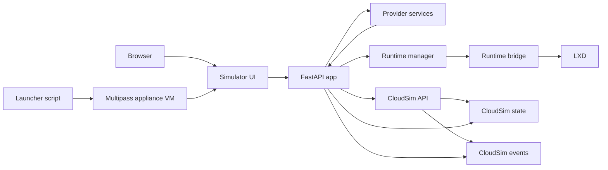

# Vyomi Component Diagram

Paste this into Mermaid Live:

## Integration Paths

- Browser talks to the simulator UI.
- The launcher starts a Multipass appliance VM.
- The simulator container inside the VM owns the UI, API, and provider routes.
- CloudSim is a separate container inside the VM and stores space-level simulation state.
- Appliance-mode EC2 execution goes through the VM-local runtime bridge to LXD only.
